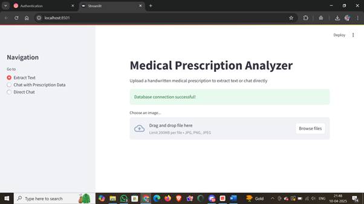
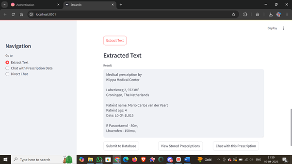
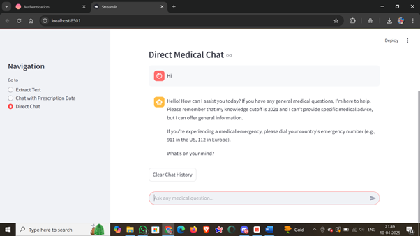
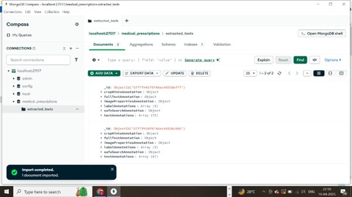

# 🩺 Medical Prescription Analyzer 📋

A powerful Streamlit application for extracting, analyzing, and querying medical prescription data using OCR technology and AI assistance.

## 📝 Description

The Medical Prescription Analyzer is a web-based application that allows users to upload images of handwritten medical prescriptions, extract text using Optical Character Recognition (OCR), store the extracted data in a MongoDB database, and interact with the data using a chat interface powered by Mistral AI.

## ✨ Features

- 📷 **Image Upload & OCR**: Upload prescription images and extract text using Tesseract OCR
- 💾 **Database Integration**: Store and retrieve prescription data using MongoDB
- 🤖 **AI-Powered Chat**: Interact with prescription data using Mistral AI's large language model
- 📱 **User-Friendly Interface**: Clean, intuitive Streamlit interface with multiple pages
- 📊 **Prescription Management**: View and manage all stored prescriptions
- 💬 **Direct Medical Chat**: Ask general medical questions without prescription data

## 🎬 Demo

### Project Video
[](https://www.youtube.com/watch?v=YOUR_VIDEO_ID)

*Click the image above to watch the demo video*

### Screenshots

#### Home Page

*The main interface where users can upload prescription images*

#### Text Extraction

*OCR in action extracting text from a prescription image*

#### Chat Interface

*AI-powered chat interface analyzing prescription data*

#### Prescription Database

*View of stored prescriptions in the database*

## 🛠️ Technologies Used

- **Frontend**: Streamlit
- **OCR Engine**: Tesseract OCR
- **Database**: MongoDB
- **AI Model**: Mistral AI (Large Language Model)
- **Image Processing**: PIL (Python Imaging Library)
- **Environment Management**: python-dotenv

## 🚀 Getting Started

### Prerequisites

- Python 3.x
- Tesseract OCR installed on your system
- MongoDB instance (local or cloud)
- Mistral AI API key

### Installation

1. Clone the repository:
```bash
git clone https://github.com/Ashish9204/medical-prescription-analysis.git
cd medical-prescription-analysis
```

2. Install required packages:
```bash
pip install -r requirements.txt
```

3. Install system dependencies:
   - For Windows:
     ```bash
     # Download and install Tesseract OCR from https://github.com/UB-Mannheim/tesseract/wiki
     ```
   - For Linux:
     ```bash
     apt-get update && apt-get install -y tesseract-ocr
     ```

4. Create a `.env` file in the project root with your API keys:
```
MISTRAL_API_KEY=your_mistral_api_key
MONGO_URI=your_mongodb_connection_string
```

### Running the Application

```bash
streamlit run app.py
```

## 📱 Usage

The application has three main pages:

### 1. Extract Text 📝
- Upload an image of a prescription
- Extract text using OCR
- Save the extracted text to the database
- View stored prescriptions
- Start a chat session with the extracted prescription

### 2. Chat with Prescription Data 💬
- Select a prescription from the database
- Ask questions about the prescription
- Get AI-powered insights and analysis

### 3. Direct Chat 🤖
- Ask general medical questions
- Get responses from the medical assistant AI

## 🔧 Configuration

The application supports both local development and cloud deployment:

- **Local Development**: Uses local Tesseract installation and MongoDB
- **Cloud Deployment**: Automatically detects Streamlit Cloud environment and adjusts paths

## 📊 Sample Data

The repository includes sample prescription images in the `sample_data` folder for testing purposes.

## 🔒 Security Note

This application handles sensitive medical information. Ensure you:
- Use secure MongoDB connections
- Protect your API keys
- Deploy with appropriate security measures
- Do not use the AI medical advice as a replacement for professional medical consultation

## 📄 License
Copyright © 2025 Ashish

*ALL RIGHTS RESERVED.*

This project and its associated files may not be copied, modified, distributed, or used for any commercial purpose without explicit permission from the author. Redistribution, modification, or commercial use of this code is strictly prohibited. Permission to use this code for personal or academic research purposes is granted only with prior written consent from the author.

## 👥 Contributors

- [Himanshu Kumar](https://github.com/dav1552)

## 🙏 Acknowledgements

- [Streamlit](https://streamlit.io/) for the amazing web framework
- [Tesseract OCR](https://github.com/tesseract-ocr/tesseract) for text extraction capabilities
- [Mistral AI](https://mistral.ai/) for the powerful language model
- [MongoDB](https://www.mongodb.com/) for database services

---

⚠️ **Disclaimer**: This application is for educational and demonstration purposes only. The AI-generated medical information should not be used as a replacement for professional medical advice, diagnosis, or treatment.

        
